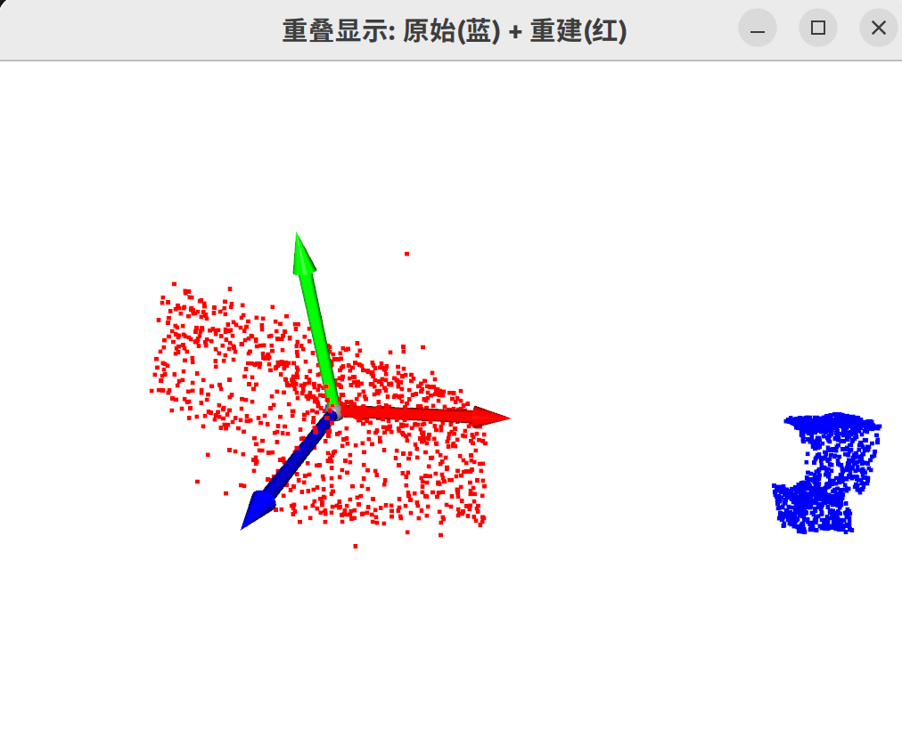
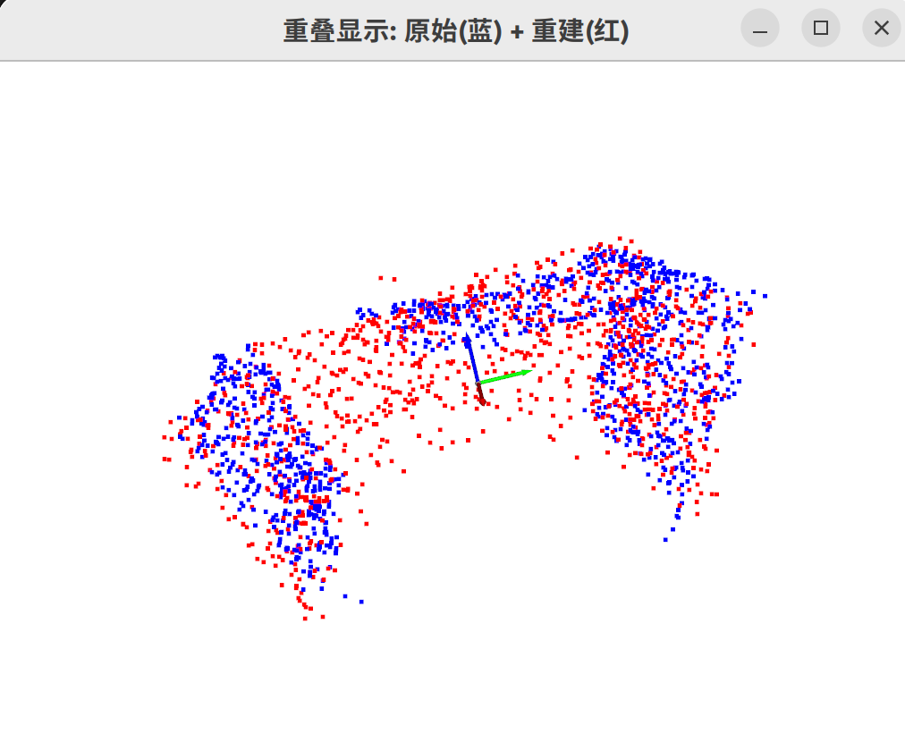

A good pointcloud pretrained encoder ready for use.

下载 Encoder 权重, PN_128 (已经下载好保存在 ./023980.pth) 
https://github.com/microsoft/UniGraspTransformer/tree/main/dexgrasp/pointnet/ckpts

这个权重对应的网络结构 https://github.com/microsoft/UniGraspTransformer/blob/main/dexgrasp/autoencoding/PN_Model.py 下载下来 (已经下载好)

调用了 maniskill_learn 中的一些依赖，从 https://github.com/microsoft/UniGraspTransformer/tree/main/dexgrasp/autoencoding/maniskill_learn 下载下来 (已经下载好)

run_encoder_pc.py 从这里摘出来点云相关部分 https://github.com/microsoft/UniGraspTransformer/blob/main/dexgrasp/tasks/state_based_grasp.py 主要是在1426行的调用以及之前的一些初始化


# 使用方法

```bash
pip install torch torchvision numpy yapf h5py sorcery open3d plyfile psutil pynvml

python run_encoder_pc.py
```

remember to center and unitize the pointcloud input to the encoder
```python
centroid = points.mean(axis=0)
points = points - centroid
max_dist = np.linalg.norm(points, axis=1).max()
if max_dist > 0:
    points = points / max_dist
```

**Key Insight**: Remember to center and unitize the input point cloud for proper encoding and reconstruction.

<div style="display: flex; justify-content: center; gap: 20px;">
  
  
</div>
<p style="text-align: center; margin-top: 5px;">
  <small>Left: Unprocessed (fails) | Right: Centered & Unitized (works)</small>
</p>